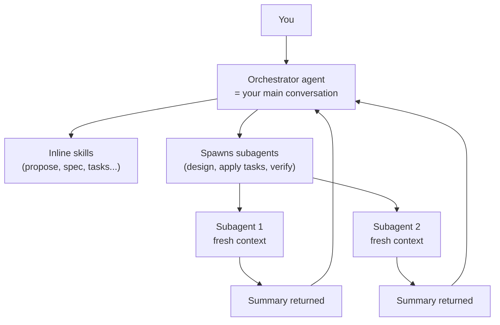

# Skills vs Agents

SDD has two concepts that often get conflated: a **skill** (what the AI knows how to do) and an **agent** (how it's executed). Understanding the difference clarifies why the workflow is structured the way it is, and why some phases feel "heavier" than others.

## Definitions

### Skill

A **skill** is a markdown instruction file with YAML frontmatter. It lives in `skills/sdd-{name}/instructions.md` and tells the AI how to perform one step of the workflow.

```markdown
---
name: sdd-spec
description: SDD Spec - write behavior specs. Usage - /sdd-spec or /sdd-spec {domain}.
model_hint: sonnet
---

# SDD Spec
...
```

Skills are **static content**. They don't run on their own — they are loaded and followed by an AI.

### Agent

An **agent** is a running AI instance with its own conversation context. There are two kinds in SDD:

| Kind | Context | Model | Example |
|------|---------|-------|---------|
| **Orchestrator** | Your main conversation | Whatever you picked in the client | The one you're talking to right now |
| **Subagent** | Fresh, isolated | Chosen via `model_hint` | Spawned by `/sdd-apply` per task |

A subagent starts with no memory of your conversation. The orchestrator hands it a self-contained prompt (instructions + context), it runs, and it returns a summary. Its context is discarded.

## Inline vs subagent execution

Most SDD skills run **inline** — you invoke the slash command, the AI loads the skill's instructions, and executes them in your current conversation. Three skills spawn **subagents** instead:

| Skill | Mode | Why |
|-------|------|-----|
| `/sdd-design` | Subagent | Design analysis is self-contained; isolating it keeps the main context clean |
| `/sdd-apply` | Orchestrator **+** one subagent per task | Each task implementation needs full file-reading context; running inline would bloat the main conversation |
| `/sdd-verify` | Subagent | Runs tests, linters, smoke checks — produces a report, no interactive decisions |
| `/sdd-discover` | Parallel subagents | Domain detection fan-out — each subagent analyzes one domain |

Everything else (propose, spec, tasks, archive, audit, steer, init, new, ff, continue, recall, docs) runs inline.

## Why this split matters

### Context hygiene

The main conversation is finite (~200K tokens effective). If `/sdd-apply` ran inline and read every file for every task, the context would fill fast and degrade quality. By spawning one subagent per task, each task gets a fresh, focused context — the orchestrator only sees the summary.

### Model selection

The `model_hint` in each skill tells orchestrators (`sdd-agent`, `sdd-ff`, `sdd-continue`, `sdd-apply`) which tier to spawn subagents on:

- `opus` — judgment-heavy (propose, design)
- `sonnet` — comprehension-heavy (spec, apply-per-task, verify, audit)
- `haiku` — mechanical (tasks, archive, docs, continue-dispatcher)

The orchestrator itself may run on a different model than its subagents. `/sdd-apply` is a good example: the orchestrator is `haiku` (just tracks task state and dispatches), but each per-task subagent is `sonnet` (writes real code).

### Prompt caching

Because subagents share a fixed prompt prefix (steering content loaded once by the orchestrator), sequential subagents benefit from Claude's 5-minute prompt cache. See [Token Optimization](token-optimization.md#prompt-caching).

## Mental model



The orchestrator is always the one talking to you. Subagents are short-lived workers whose output is a report, not a conversation.

## Practical implications

- **Clearing context** (`/clear`, new session) affects the orchestrator, not past subagents. Subagents don't persist — they're already gone.
- **Interactive questions** (proposals, design decisions) must happen in the orchestrator. A subagent can't ask you anything mid-run; it either succeeds or reports a blocker.
- **`/sdd-continue`** detects phase from artifacts, not conversation history — so you can start a fresh orchestrator at any time. See [Token Optimization: when to clear context](token-optimization.md#when-to-clear-context).
