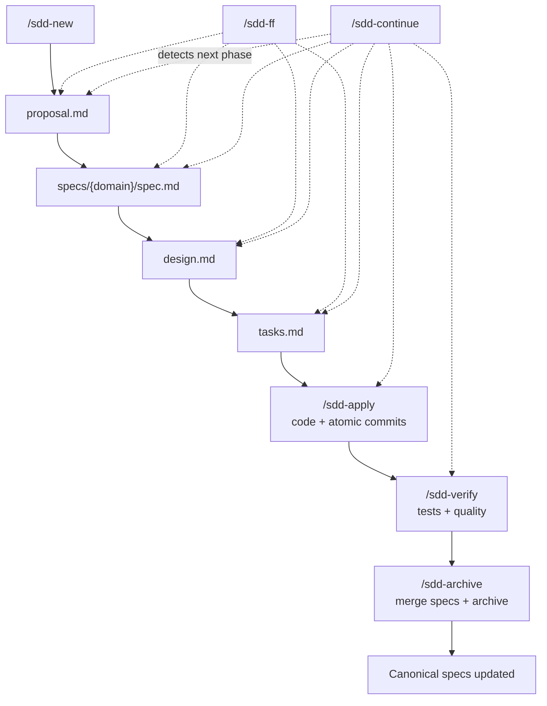

# The SDD Workflow

Spec-Driven Development is a methodology where every code change follows a structured pipeline: **problem → specification → design → implementation → verification**. Each phase produces an artifact that feeds the next.

## Phase diagram

## Phases explained

### 1. Explore

**Skill:** `/sdd-explore` (or embedded in `/sdd-new`)

Read-only analysis of the codebase. The AI reads existing code, identifies patterns, checks canonical specs, and builds context. No files are created or modified.

### 2. Propose

**Skill:** `/sdd-propose` (or embedded in `/sdd-new`)
**Artifact:** `proposal.md`

Defines the **problem** and **proposed solution**. Includes alternatives that were discarded and why, plus an impact estimate (files, domains, tests). This is the "why" document.

### 3. Spec

**Skill:** `/sdd-spec`
**Artifact:** `specs/{domain}/spec.md`

Describes **expected behavior** — not implementation. Uses Given/When/Then format for behavior definitions. The spec is a **delta** against the canonical spec — only what changes is documented.

!!! important
    The spec phase is where most bugs are prevented. A clear spec means fewer surprises during implementation.

### 4. Design

**Skill:** `/sdd-design`
**Artifact:** `design.md`
**Execution:** runs as a **subagent** (non-interactive — reads files, produces artifact)

Translates the behavior spec into a concrete **implementation plan**. Lists every file to create or modify, architecture decisions, and scope assessment. If scope exceeds 20 files, the design recommends splitting the change.

### 5. Tasks

**Skill:** `/sdd-tasks`
**Artifact:** `tasks.md`

Breaks the design into **atomic tasks**. Each task corresponds to one file and one commit. Tasks are ordered by dependencies: interfaces first, then implementations, then tests.

### 6. Apply

**Skill:** `/sdd-apply`
**Execution:** orchestrator spawns **one agent per task**

Implements code task by task. Each task runs in its own subagent to keep the orchestrator context clean:

1. Agent reads similar code, implements the change, runs quality checks, commits atomically
2. Agent returns a summary (files touched, commit hash, test result)
3. Orchestrator marks task as done, asks user before launching the next agent

Nothing is implemented without being tracked. Unplanned work gets registered as `BUGxx` or `IMPxx` before implementation.

### 7. Verify

**Skill:** `/sdd-verify`
**Execution:** runs as a **subagent** (non-interactive — runs checks, produces report)

Final validation: full test suite, linter, self-review checklist, convention audit, and smoke test (for UI projects). All checks must pass before proceeding. Creates the PR.

### 8. Archive

**Skill:** `/sdd-archive`

Closes the cycle:

1. Merges delta specs into canonical specs at `openspec/specs/`
2. Updates `openspec/INDEX.md`
3. Moves the change to `openspec/changes/archive/{date}-{change-name}/`

After archive, canonical specs reflect the current system state.

## Two speeds

| Path | When to use | Commands |
|------|------------|----------|
| **Standard** | Complex changes, team review needed | `/sdd-new` then `/sdd-continue` repeatedly |
| **Fast-forward** | Clear scope, straightforward | `/sdd-ff` then `/sdd-apply` |

The fast-forward path generates all documentation in one pass (propose + spec + design + tasks). Use it when the change is simple enough that you trust the AI's judgment without reviewing each phase.

## Principles

1. **Specs before code** — define behavior, then implement
2. **Atomic commits** — one task, one file, one commit
3. **No unilateral decisions** — the AI asks when something unexpected comes up
4. **Living documentation** — specs are always current after archive
5. **Project memory** — conventions and rules persist across sessions via steering
